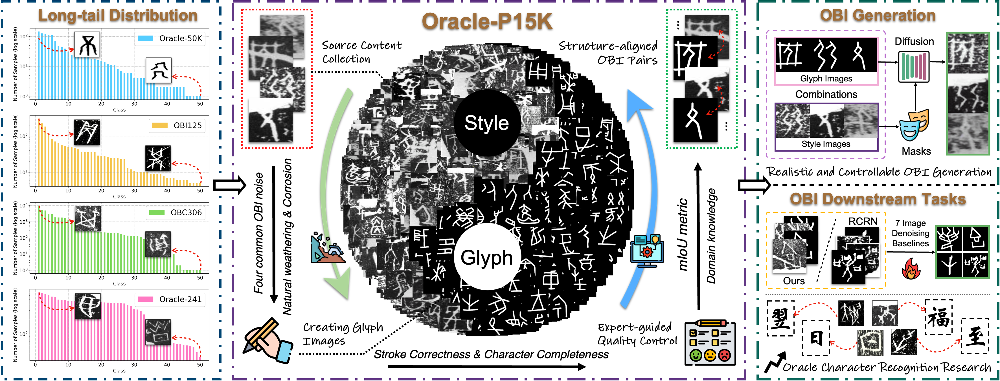
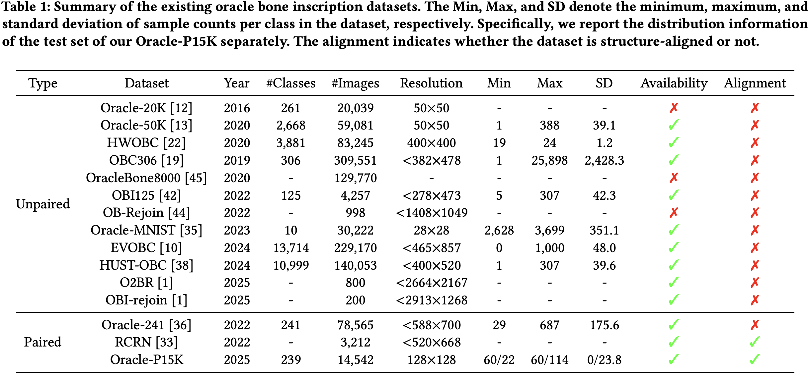
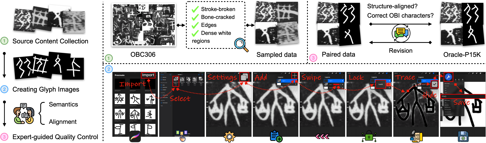
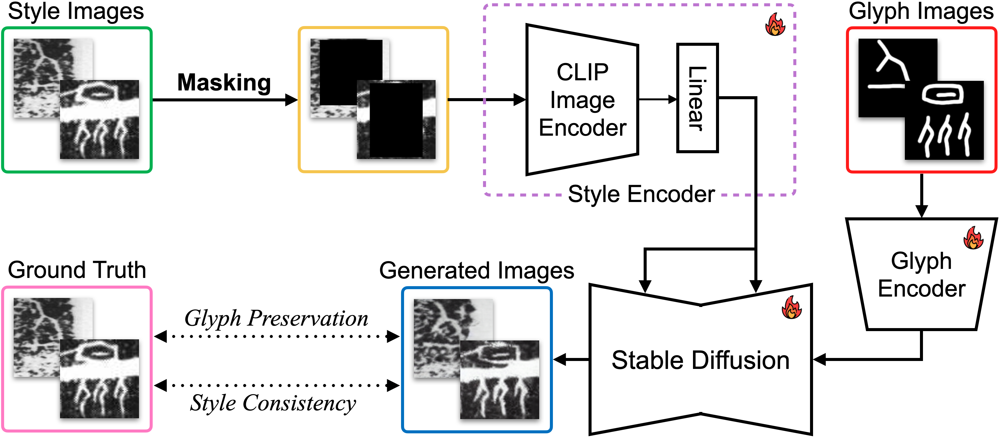
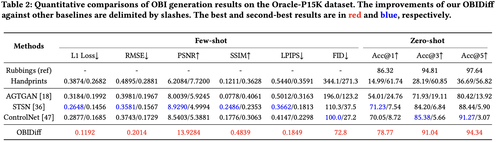
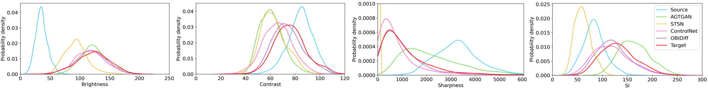
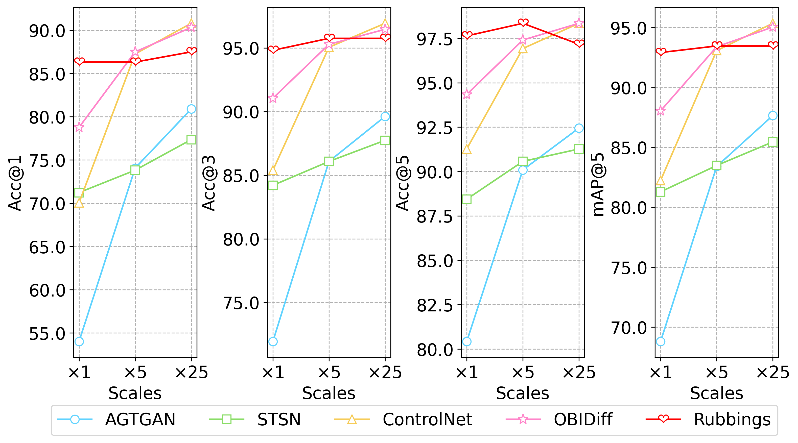
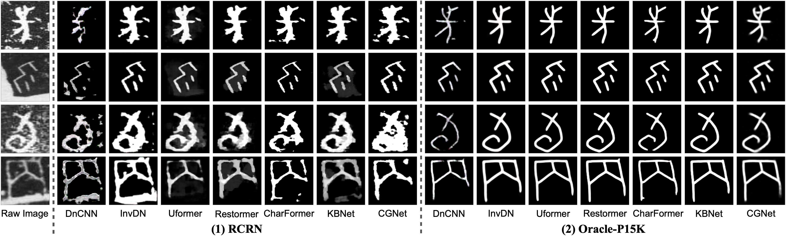
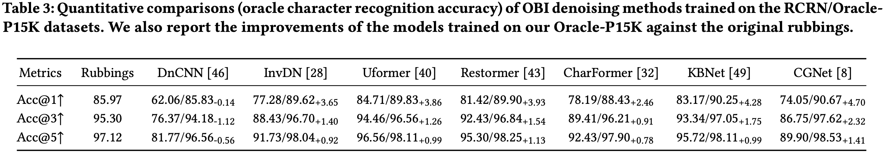
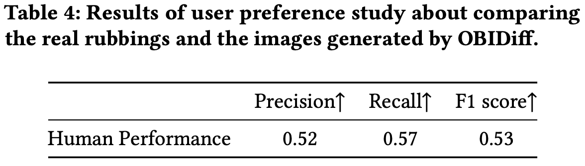

<div align="center">
<div>
<a href="https://github.com/OBI-Future/Oracle-P15K"></a>
    <a href="https://github.com/OBI-Future/Oracle-P15K"></a>
    <!-- <a href="https://arxiv.org/abs/2412.01175"></a> -->
    <a href="https://github.com/OBI-Future/Oracle-P15K"></a>
</div>

<h1>Mitigating Long-tail Distribution in Oracle Bone Inscriptions: Dataset, Model, and Benchmark ☯️</h1>

_The first attempt to apply diffusion model in realistic and controllable OBI generation_

<div>
    <a href="https://cs.ecnu.edu.cn" target="_blank">Jinhao Li</a><sup>1*</sup>,
    <a href="https://scholar.google.com.hk/citations?hl=zh-CN&user=NSR4UkMAAAAJ" target="_blank">Zijian Chen</a><sup>2*</sup>,
    <a href="https://shss.sjtu.edu.cn" target="_blank">Runze Jiang</a><sup>3</sup>,
    <a href="https://shss.sjtu.edu.cn/Web/FacultyDetail/46?f=1&t=4" target="_blank">Tingzhu Chen</a><sup>3&dagger;</sup>,
    <a href="https://faculty.ecnu.edu.cn/_s16/wzb/main.psp" target="_blank">Changbo Wang</a><sup>1&dagger;</sup>,
    <a href="https://scholar.google.com.hk/citations?hl=zh-CN&user=E6zbSYgAAAAJ" target="_blank">Guangtao Zhai</a><sup>2</sup>
</div>

<div>
  <sup>1</sup>School of Computer Science and Technology, East China Normal University

  <sup>2</sup>Institute of Image Communication and Information Processing, Shanghai Jiao Tong University
  <sup>3</sup>School of Humanities, Shanghai Jiao Tong University

  <sup>*</sup>Both authors contributed equally to this research
  <sup>&dagger;</sup>Corresponding authors 
</div>   

<!-- 中文版速递：[知乎](https://zhuanlan.zhihu.com/p/10309270594) -->

<div style="width: 100%; text-align: center; margin:auto;">
      
  </div>
</div>
<br>

> Overview of the proposed **Oracle-P15K** dataset. The dataset comprises 14,542 OBI images with structure-aligned expert-annotated glyphs. Based on this, we present a pseudo OBI image generator, namely **OBIDiff**, to alleviate the long-tail distribution problem in current OBI datasets. Extensive experiments demonstrate both the necessity of Oracle-P15K and the effectiveness of OBIDiff in improving the performance of downstream OBI tasks.

## Release 🚀
- [2025/4/13] ⚡️ [Github repo](https://github.com/OBI-Future/Oracle-P15K) for **Oracle-P15K** is online.

## Motivations 💡

The existing OBI datasets suffer from a long-tail distribution problem. Consequently, OBI-related models achieve superior performance in majority classes while underperforming in minority classes. Therefore, we construct **Oracle-P15K**, a large-scale structure-aligned OBI dataset comprising **14,542** images infused with domain knowledge from OBI experts. The Oracle-P15K dataset can also serve as a comprehensive benchmark for researchers to develop and evaluate their methods for dealing with other OBI information processing tasks, such as OBI denoising, recognition, etc.

<div style="width: 100%; text-align: center; margin:auto;">
      
  </div>

## Construction Pipeline 🧩

Focusing on **structure-aligned** image pairs for OBI generation and denoising models.

<div style="width: 100%; text-align: center; margin:auto;">
      
  </div>

## Pseudo OBI Generator 🤖

Our **OBIDiff** consists of an autoencoder, a stable diffusion (SD) model, a glyph encoder, and a style encoder. Given a clean glyph image and a target rubbing-style image, it can effectively transfer the noise style of the original rubbing to the glyph image.

<div style="width: 60%; text-align: center; margin:auto;">
      
  </div>

## Results on OBI Generation and Denoising Tasks 📌

<details close>
<summary>Qualitative results on the OBI generation tasks (click to expand)</summary>

<div style="width: 100%; text-align: center; margin:auto;">
      
  </div>
</details>

<details close>
<summary>Quantitative results on the OBI generation tasks (click to expand)</summary>

<div style="width: 100%; text-align: center; margin:auto;">
      
  </div>

- Fitted kernel distribution of four low-level features including brightness, contrast, sharpness, and spatial information (SI):

<div style="width: 100%; text-align: center; margin:auto;">
      
  </div>

- Recognition accuracy of augmented images generated by the proposed OBIDiff and other OBI generation methods w.r.t. the scale of data augmentation:

<div style="width: 60%; text-align: center; margin:auto;">
      
  </div>
</details>

<details close>
<summary>Qualitative results on the OBI denoising tasks (click to expand)</summary>

<div style="width: 100%; text-align: center; margin:auto;">
      
  </div>
</details>

<details close>
<summary>Quantitative results on the OBI denoising tasks (click to expand)</summary>

<div style="width: 100%; text-align: center; margin:auto;">
      
  </div>
</details>

## User Preference Study 👥

We develop a web-based [user interface](https://ljholyground.github.io/) with automated navigation to facilitate the evaluation process.

<div style="width: 60%; text-align: center; margin:auto;">
      
  </div>
</details>

## Contact ✉️

Please contact the first author of this paper for queries.

- Jinhao Li, `lomljhoax@stu.ecnu.edu.cn`

## Citation 📎
<!-- If you find our work interesting, please feel free to cite our paper:
```
@article{chen2024obi,
  title={OBI-Bench: Can LMMs Aid in Study of Ancient Script on Oracle Bones?},
  author={Chen, Zijian and Chen, Tingzhu and Zhang, Wenjun and Zhai, Guangtao},
  journal={arXiv preprint arXiv:2412.01175},
  year={2024}
}
``` -->
Coming soon...

## <a name="acknowledgements"></a> Acknowledgements 🏆

This work was supported by the National Social Science Foundation of China (24Z300404220) and the Shanghai Philosophy and Social Science Planning Project (2023BYY003).
